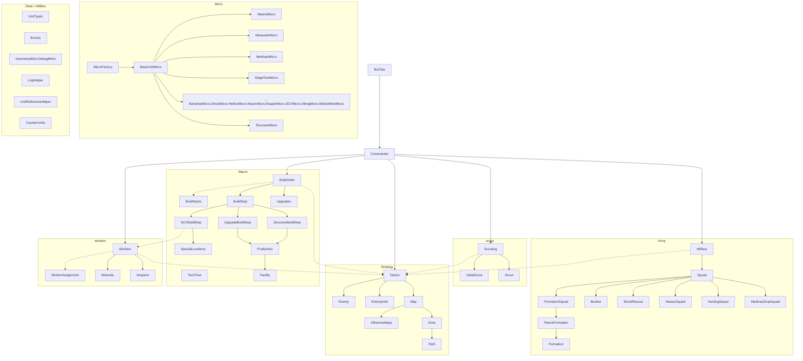

# Bottato Architecture

## Composition / Ownership

```mermaid
graph TD

    subgraph Army
        Military["Military"]
        Squad["Squad"]
        FormationSquad["FormationSquad"]
        ParentFormation["ParentFormation"]
        Formation["Formation"]
        Bunker["Bunker"]
        StuckRescue["StuckRescue"]
        HarassSquad["HarassSquad"]
        HuntingSquad["HuntingSquad"]
        MedivacDropSquad["MedivacDropSquad"]
    end
    
    subgraph scout
        Scouting["Scouting"]
        InitialScout["InitialScout"]
        Scout["Scout"]
    end
    
    subgraph Strategy
        Tactics["Tactics"]
        Enemy["Enemy"]
        EnemyIntel["EnemyIntel"]
        Map["Map"]
        InfluenceMaps["InfluenceMaps"]
        Zone["Zone"]
        Path["Path"]
    end

    subgraph Macro
        BuildStarts["BuildStarts"]
        BuildOrder["BuildOrder"]
        BuildStep["BuildStep"]
        SCVBuildStep["SCVBuildStep"]
        StructureBuildStep["StructureBuildStep"]
        UpgradeBuildStep["UpgradeBuildStep"]
        Upgrades["Upgrades"]
        TechTree["TechTree"]
        SpecialLocations["SpecialLocations"]
        Production["Production"]
        Facility["Facility"]
    end
    subgraph workers
        Workers["Workers"]
        WorkerAssignment
        Minerals["Minerals"]
        Vespene["Vespene"]
    end

    subgraph Micro
        MicroFactory["MicroFactory"]
        BaseUnitMicro["BaseUnitMicro"]
        MarineMicro["MarineMicro"]
        MarauderMicro["MarauderMicro"]
        MedivacMicro["MedivacMicro"]
        SiegeTankMicro["SiegeTankMicro"]
        OtherMicros["... BansheeMicro,GhostMicro,HellionMicro,RavenMicro,ReaperMicro,SCVMicro,VikingMicro,WidowMineMicro"]
        StructureMicro
    end

    subgraph Data["Data / Utilities"]
        UnitTypes["UnitTypes"]
        Enums["Enums"]
        Mixins["GeometryMixin,DebugMixin"]
        LogHelper["LogHelper"]
        UnitReferenceHelper["UnitReferenceHelper"]
        CounterUnits["CounterUnits"]
    end

    BotTato --> Commander

    %% Commander creates
    Commander --> Tactics
    Commander --> Workers
    Commander --> Military
    Commander --> BuildOrder
    Commander --> Scouting

    Tactics --> Enemy
    Tactics --> Map
    Tactics --> EnemyIntel

    %% Military creates
    Military --> Squad
    Military -.-> Tactics

    Squad --> FormationSquad
    Squad --> Bunker
    Squad --> HarassSquad
    Squad --> HuntingSquad
    Squad --> StuckRescue
    Squad --> MedivacDropSquad

    %% BuildOrder creates/refs
    BuildOrder --> BuildStep
    BuildOrder --> Upgrades
    BuildOrder -.-> Tactics
    BuildOrder -.-> BuildStarts

    BuildStep --> SCVBuildStep
    BuildStep --> StructureBuildStep
    BuildStep --> UpgradeBuildStep

    StructureBuildStep --> Production
    UpgradeBuildStep --> Production
    SCVBuildStep --> SpecialLocations
    SCVBuildStep -.-> Workers

    %% Workers
    Workers --> Minerals
    Workers --> Vespene
    Workers -.-> Tactics
    Workers -.-> WorkerAssignment

    %% Production
    Production --> Facility

    %% Map
    Map --> InfluenceMaps
    Map --> Zone
    Zone --> Path

    %% Scouting
    Scouting --> Scout
    Scouting --> InitialScout
    Scouting -.-> Tactics

    %% Squad internals
    FormationSquad --> ParentFormation
    ParentFormation --> Formation

    %% Micro
    MicroFactory --> BaseUnitMicro
    BaseUnitMicro --> MarineMicro
    BaseUnitMicro --> MarauderMicro
    BaseUnitMicro --> MedivacMicro
    BaseUnitMicro --> SiegeTankMicro
    BaseUnitMicro --> OtherMicros
    BaseUnitMicro --> StructureMicro
```
