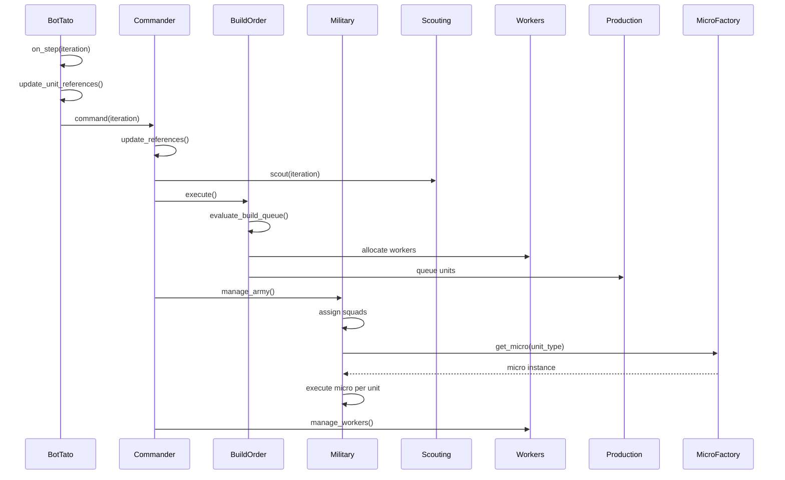

# Bottato Architecture

## Composition / Ownership

```mermaid
graph TD
    subgraph Core
        BotTato["🤖 BotTato\n(BotAI)"]
        Commander["⚔️ Commander"]
        LogHelper["📝 LogHelper"]
        UnitReferenceHelper["🔗 UnitReferenceHelper"]
    end

    BotTato -->|creates| Commander
    BotTato -->|inits| LogHelper
    BotTato -->|inits| UnitReferenceHelper

    subgraph Strategy
        Military["🎖️ Military"]
        Enemy["👾 Enemy"]
        EnemyIntel["🔍 EnemyIntel"]
        Counter["⚖️ Counter"]
    end

    subgraph Building
        BuildOrder["📋 BuildOrder"]
        SCVBuildStep["🔨 SCVBuildStep"]
        StructureBuildStep["🏗️ StructureBuildStep"]
        UpgradeBuildStep["⬆️ UpgradeBuildStep"]
        SpecialLocations["📍 SpecialLocations"]
        BuildStarts["🕐 BuildStarts"]
    end

    subgraph Economy
        Workers["👷 Workers"]
        Production["🏭 Production"]
        Minerals["💎 Minerals"]
        Vespene["⛽ Vespene"]
        Facility["🏢 Facility"]
    end

    subgraph MapModule["Map"]
        Map["🗺️ Map"]
        InfluenceMaps["🌡️ InfluenceMaps"]
        Zone["📍 Zone"]
        Path["🛤️ Path"]
    end

    subgraph Squads
        FormationSquad["🪖 FormationSquad"]
        Bunker["🏰 Bunker"]
        HarassSquad["💥 HarassSquad"]
        HuntingSquad["🎯 HuntingSquad"]
        StuckRescue["🆘 StuckRescue"]
        Scouting["👁️ Scouting"]
        Scout["🔭 Scout"]
        InitialScout["🔭 InitialScout"]
        EnemySquad["👾 EnemySquad"]
        Formation["📐 Formation"]
        ParentFormation["📐 ParentFormation"]
    end

    subgraph Micro
        MicroFactory["🔧 MicroFactory"]
        BaseUnitMicro["🎮 BaseUnitMicro"]
        StructureMicro["🏗️ StructureMicro"]
        MarineMicro["🔫 MarineMicro"]
        MarauderMicro["💪 MarauderMicro"]
        MedivacMicro["🚁 MedivacMicro"]
        SiegeTankMicro["🔥 SiegeTankMicro"]
        OtherMicros["... BansheeMicro\nGhostMicro\nHellionMicro\nRavenMicro\nReaperMicro\nSCVMicro\nVikingMicro\nWidowMineMicro"]
    end

    subgraph Data["Data / Utilities"]
        UnitTypes["📊 UnitTypes"]
        Upgrades["📈 Upgrades"]
        TechTree["🌳 TechTree"]
        Enums["🏷️ Enums"]
        Mixins["🧩 GeometryMixin\nDebugMixin"]
    end

    %% Commander creates
    Commander -->|creates| Enemy
    Commander -->|creates| Map
    Commander -->|creates| Production
    Commander -->|creates| EnemyIntel
    Commander -->|creates| StructureMicro
    Commander -->|creates| Workers
    Commander -->|creates| Military
    Commander -->|creates| BuildOrder
    Commander -->|creates| Scouting
    Commander -->|calls| MicroFactory

    %% Military creates
    Military -->|creates| FormationSquad
    Military -->|creates| Bunker
    Military -->|creates| HarassSquad
    Military -->|creates| HuntingSquad
    Military -->|creates| StuckRescue
    Military -.->|refs| Enemy
    Military -.->|refs| Map
    Military -.->|refs| Workers
    Military -.->|refs| EnemyIntel

    %% BuildOrder creates/refs
    BuildOrder -->|creates| Counter
    BuildOrder -->|creates| UnitTypes
    BuildOrder -->|creates| Upgrades
    BuildOrder -->|creates| SpecialLocations
    BuildOrder -->|manages| SCVBuildStep
    BuildOrder -->|manages| StructureBuildStep
    BuildOrder -->|manages| UpgradeBuildStep
    BuildOrder -.->|refs| Workers
    BuildOrder -.->|refs| Production
    BuildOrder -.->|refs| Map
    BuildOrder -.->|refs| Military
    BuildOrder -.->|refs| EnemyIntel
    BuildOrder -.->|refs| Enemy

    %% Workers
    Workers -->|creates| Minerals
    Workers -->|creates| Vespene
    Workers -.->|refs| Enemy
    Workers -.->|refs| Map

    %% Production
    Production -->|manages| Facility

    %% Map
    Map -->|creates| InfluenceMaps
    Map -->|manages| Zone
    Zone -->|contains| Path

    %% Scouting
    Scouting -->|creates| Scout
    Scouting -->|creates| InitialScout
    Scouting -.->|refs| Enemy
    Scouting -.->|refs| Map
    Scouting -.->|refs| Workers
    Scouting -.->|refs| Military
    Scouting -.->|refs| EnemyIntel

    %% Squad internals
    FormationSquad -->|creates| ParentFormation
    ParentFormation -->|manages| Formation
    StuckRescue -.->|refs| FormationSquad
    Enemy -->|manages| EnemySquad
    EnemyIntel -.->|refs| Map
    EnemyIntel -.->|refs| Enemy

    %% Micro
    MicroFactory -->|creates/caches| BaseUnitMicro
    MicroFactory -->|creates/caches| StructureMicro
    MicroFactory -->|creates/caches| MarineMicro
    MicroFactory -->|creates/caches| MarauderMicro
    MicroFactory -->|creates/caches| MedivacMicro
    MicroFactory -->|creates/caches| SiegeTankMicro
    MicroFactory -->|creates/caches| OtherMicros

    %% Data references
    BuildOrder -.->|uses| TechTree
    UnitTypes -.->|uses| Enums
    Counter -.->|uses| UnitTypes
    Upgrades -.->|uses| TechTree
```

## Inheritance

```mermaid
classDiagram
    class BotAI
    class BotTato
    BotAI <|-- BotTato

    class Squad
    Squad <|-- FormationSquad
    Squad <|-- Bunker
    Squad <|-- HarassSquad
    Squad <|-- HuntingSquad
    Squad <|-- Scouting
    Squad <|-- Scout
    Squad <|-- InitialScout
    Squad <|-- EnemySquad
    Squad <|-- StuckRescue

    class BuildStep
    BuildStep <|-- SCVBuildStep
    BuildStep <|-- StructureBuildStep
    BuildStep <|-- UpgradeBuildStep

    class BaseUnitMicro
    BaseUnitMicro <|-- StructureMicro
    BaseUnitMicro <|-- MarineMicro
    BaseUnitMicro <|-- MarauderMicro
    BaseUnitMicro <|-- MedivacMicro
    BaseUnitMicro <|-- SiegeTankMicro
    BaseUnitMicro <|-- BansheeMicro
    BaseUnitMicro <|-- GhostMicro
    BaseUnitMicro <|-- HellionMicro
    BaseUnitMicro <|-- RavenMicro
    BaseUnitMicro <|-- ReaperMicro
    BaseUnitMicro <|-- SCVMicro
    BaseUnitMicro <|-- VikingMicro
    BaseUnitMicro <|-- WidowMineMicro

    class Resources
    Resources <|-- Minerals
    Resources <|-- Vespene
```

## Game Loop Flow

```mermaid
sequenceDiagram
    participant BT as BotTato
    participant CMD as Commander
    participant BO as BuildOrder
    participant MIL as Military
    participant SC as Scouting
    participant W as Workers
    participant P as Production
    participant MF as MicroFactory

    BT->>BT: on_step(iteration)
    BT->>BT: update_unit_references()
    BT->>CMD: command(iteration)
    CMD->>CMD: update_references()
    CMD->>SC: scout(iteration)
    CMD->>BO: execute()
    BO->>BO: evaluate_build_queue()
    BO->>W: allocate workers
    BO->>P: queue units
    CMD->>MIL: manage_army()
    MIL->>MIL: assign squads
    MIL->>MF: get_micro(unit_type)
    MF-->>MIL: micro instance
    MIL->>MIL: execute micro per unit
    CMD->>W: manage_workers()
```
